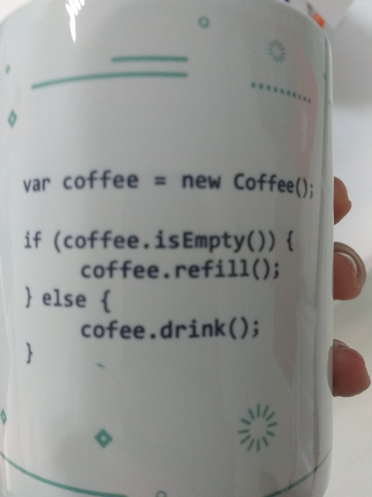

Regulamento do teste 
--------------------

Escreva um teste que: verifique se há café, se não houver, preencha com café ou se há café, beba seu café.
Após escrever o teste, implementar o código igual na imagem: 

Rodar o teste que deve seguir o ciclo do TDD com um commit para cada etapa do cliclo (red, green, refactor)  
O teste deve verificar as unidades, ou seja, para cada possível resultado deve existir um teste. 

Deve haver 100% de cobertura.

Como mandar seu teste
---------------------

Fork do projeto, crie uma pasta com seu nome (como no cracha), ex: '~/sergio_siqueira/' contendo seu código. 
Após tudo pronto abra um PR.

Ferramentas
-----------

O teste deve usar uma biblioteca da familia Unit (Ex: PHPUnit, Mocha/Chai)
